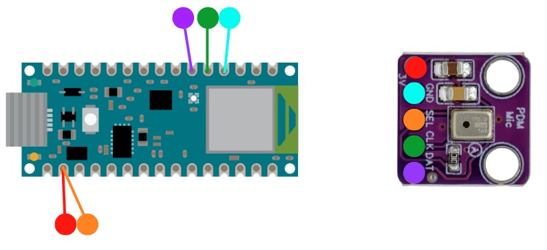

# Nano-33-On-Inference-Keyword-Spotting
AI scalable Embedded application that recognizes 1-sec audio samples using an Arduino Nano 33 BLE with an external Omnidirectional Microphone Module MEMS Digital PDM. The code should work for Arduino Nano 33 BLE Sense, too, however the data given in input since they were sampled via this external module can be slightly different, leading to inaccuracy. It contains 1MB Flash CPU, For complete datasheet, pinout and schematics, check out this url: [Arduino Nano 33 BLE](https://docs.arduino.cc/hardware/nano-33-ble/).

The project was run on Linux Ubuntu 24.04 LTS with a machine with a dedicated NVIDIA GeForce RTX 5060, but the project can work using CPU too. The objective of the project was to recognize 4 classes (clap, tap, snap, silence [collapse class]) with a model that fits the device.

The pipeline followed to perform this was:
1. Environment Setup
2. Data Collection
3. MFCC Conversion using CMSIS and Training
4. Deployment on Device

The project is scalable with other audio signals and via the colab file these can be easily added, but requires careful management on deployment code with the addition of that label and modifying the number of classes.

# Table of Contents
- [Project Structure](#project-structure)
- [Requirements](#requirements)
- [IDE Setup](#ide-setup)
  - [Visual Studio Code](#visual-studio-code)
  - [Arduino IDE](#arduino-ide)
  - [Virtual Environment](#virtual-environment)
  - [Hardware Setup](#hardware-setup)
- [Project Running](#project-running)
  - [Data Acquisition](#data-acquisition)
  - [Features Extraction and Training](#features-extraction-and-training)
  - [Deployment](#deployment)
- [Contacts](#contacts)

# Project Structure
```
Nano-33-On-Inference-Keyword-Spotting
|- dataset                  # Folder containing data collected in reconstructed .wav (only numerical, not full audible format)
|- audio_capture            # Folder with code to verify if the microphone is working
|- deployment               # Folder with code to perform deployment on MCU
|- sound_model.tflite       # TFLite model generated for deployment
|- data_collection.ipynb    # Collection + Training colab code
|- packages_checker.py      # Python code packages checker
|- requirements.txt         # Requirements list for virtual environment
|- setup.sh                 # Code for setup the virtual environment
```

Note that those .wav files were not standard playable audio files but raw numerical data.
[Go to Table of Contents](#table-of-contents)

---

# Requirements
- Arduino Nano 33 BLE Rev2 (or Arduino Nano 33 Sense BLE Rev2)
- Cable compatible
- If with non-Sense, Omnidirectional Microphone Module MEMS Digital PDM MP34DT01
- If with non-Sense, a 100 Ohm resistor to clear the clock signal
- Arduino IDE ([Download](https://support.arduino.cc/hc/en-us/articles/360019833020-Download-and-install-Arduino-IDE)) or Deploy on Arduino Cloud
- Visual Studio Code ([Download](https://code.visualstudio.com/download))
  
[Go to Table of Contents](#table-of-contents)

---

# Setup
Follow these steps to configure the development environments and setting up the virtual environment for python running with local GPU, however this second part can be also done on Google Colab importing there .ipynb file.
## Visual Studio Code
Download the following extensions in the Marketplace in the application:
- Python
- Jupyter

## Arduino IDE
(The project was run on local machine, on Arduino Cloud all libraries should be already installed)
Download the following board support from Boards Manager:
- Arduino Mbed OS Nano Boards by Arduino

After the board, are required some extra libraries from library manager:
- Arduino_CMSIS-DSP by Arduino (PDM and audio processing core features)
- ArduTFLite by Chirale (Neural Network Support Library)

To verify the correctness of the library of the board, plug in the computer the MCU and go to "Tools > Board > Arduino Mbed OS > Arduino Nano 33 BLE. If the label above becomes bold it means the device is detected. Some computers may recognize the device, but not have the permission to exchange the data between the computer and that and this requires extra management. 

irst of all run this bash command that will open the permission manager:
```bash
sudo nano /etc/udev/rules.d/99-arduino.rules
```
In the environment copy and paste this:
```bash
SUBSYSTEMS=="usb", ATTRS{idVendor}=="2341", ATTRS{idProduct}=="005a", MODE="0666">
SUBSYSTEMS=="usb", ATTRS{idVendor}=="2341", ATTRS{idProduct}=="805a", MODE="0666">
```
Then perform "Ctrl + Shift + O" To Write and "Ctrl + Shift + X" to close.
To end and saving permanently these changes to always take effect run this bash:
```bash
sudo udevadm control --reload-rules && sudo udevadm trigger
```

## Virtual Environment 

This is required only if you want to create a kernel for run .ipynb file on local machine for simplicity use Google Colab.
First of all, navigate through this folder downloaded on the computer. When in the location run:
```bash
chmod +x run.sh
./run.sh
```
This will trigger the setup.sh script and it will perform the following things:
- If on a linux machine trying to install xxd library which facilitate the convertion from .tflite file to C header
- Check the python3 and pip3 installation
- Create a virtual environment in the locatin in which the bash command above was run in and activates it
- Install manually tensorflow correct version if for CPU or GPU and then all libraries in requirements.txt
- Checks if all packages were installed correctly

Then go to Visual Studio and open the .ipynb file and pressing button combination "Ctrl + Shift + P" and typing the bar that pops up "Select Interpreter" enables to enter interpreter path. To gather the correct one, run the bash code in the terminal use before, copy and paste the output and add at the end "/.tf-env/bin/python"
```bash
pwd
```

[Go to Table of Contents](#table-of-contents)

---

## Hardware Setup

<table align="center">
  <tr>
    <td>
      
    </td>
  </tr>
</table>

The physical connections are composed as followed:
<table align="center">
    <tr>
        <td>Color</td>
        <td>Pin Nano 33 BLE</td>
        <td>Function</td>
        <td>Note</td>
    </tr>
    <tr>
        <td>Red</td>
        <td>+3V3</td>
        <td>Voltage of 3.3 V</td>
        <td>-</td>
    </tr>
    <tr>
        <td>Light Blue</td>
        <td>GND</td>
        <td>Ground</td>
        <td>-</td>
    </tr>
    <tr>
        <td>Orange</td>
        <td>+3V3</td>
        <td>Selector</td>
        <td>-</td>
    </tr>
    <tr>
        <td>Dark Green</td>
        <td>P1.11</td>
        <td>PDM Clock</td>
        <td>Use 100 Ohm Resistor to reduce signal noise</td>
    </tr>
    <tr>
        <td>Purple</td>
        <td>P1.12</td>
        <td>PDM Data</td>
        <td>-</td>
    </tr>
</table>
The pins are not setup by default, so we have to manually modify the parameter related to those, so you need to go to "~/.arduino15/packages/arduino/hardware/mbed_nano/4.5.0/variants/ARDUINO_NANO33BLE/variants.cpp", going under PWM and change the default pins for Arduino Nano 33 BLE Sense to P1_11 for PDM CLK and P1_12 for PDM DIN.

WARNING: Note that if the board core is updated that file with all the changes applied will be overwritten and it will affect all other projects using the board. Those pins are not used for any function, but be careful in which you are choosing.

[Go to Table of Contents](#table-of-contents)

---

# Project Running

## Data Acquisition
If all the setup was performed, open a new sketch in "File > Open..." and select audio_capture, since we have to check that all is ready and the pins of the microphone are correctly configured. Before you run the code press "Ctrl + Shift + M", this will open the Serial Monitor that will enable to see the output. During the execution if you see any fluctuation in correspondence to the voice that means that it works.

## Feature Extraction and Training
The audio capturing will be done by the user with a simple typing of the class and after pressing enter the sound will be registered and the samples will be saved in the corresponding folder. Note that the audio is not reproducible from the file, since it is not .wav encoded, but a fast way to save that to be parsed into the feature extraction logic. 

In the training cell, the code will then divide the dataset for each single .csv taking 70% for training, 15% for validation and 15% for testing. Considering that the code will need the MEAN and STD deviation of the signal and on inference that is not possible the output of the file should be copy and pasted on .ino file in deployment folder.

After this  there is the training phase and to demonstrate the correctness of the model, in the repository there is the confusion matrix (confusion_matrix.png). The model is saved in "sound_model.tflite". 
The structure of the model is the following:
```
┏━━━━━━━━━━━━━━━━━━━━━━━━━━━━━━━━━┳━━━━━━━━━━━━━━━━━━━━━━━━┳━━━━━━━━━━━━━━━┓
┃ Layer (type)                    ┃ Output Shape           ┃       Param # ┃
┡━━━━━━━━━━━━━━━━━━━━━━━━━━━━━━━━━╇━━━━━━━━━━━━━━━━━━━━━━━━╇━━━━━━━━━━━━━━━┩
│ conv2d_6 (Conv2D)               │ (None, 13, 32, 8)      │            80 │
├─────────────────────────────────┼────────────────────────┼───────────────┤
│ batch_normalization_6           │ (None, 13, 32, 8)      │            32 │
│ (BatchNormalization)            │                        │               │
├─────────────────────────────────┼────────────────────────┼───────────────┤
│ max_pooling2d_6 (MaxPooling2D)  │ (None, 6, 16, 8)       │             0 │
├─────────────────────────────────┼────────────────────────┼───────────────┤
│ dropout_7 (Dropout)             │ (None, 6, 16, 8)       │             0 │
├─────────────────────────────────┼────────────────────────┼───────────────┤
│ conv2d_7 (Conv2D)               │ (None, 6, 16, 16)      │         1,168 │
├─────────────────────────────────┼────────────────────────┼───────────────┤
│ batch_normalization_7           │ (None, 6, 16, 16)      │            64 │
│ (BatchNormalization)            │                        │               │
├─────────────────────────────────┼────────────────────────┼───────────────┤
│ max_pooling2d_7 (MaxPooling2D)  │ (None, 3, 8, 16)       │             0 │
├─────────────────────────────────┼────────────────────────┼───────────────┤
│ dropout_8 (Dropout)             │ (None, 3, 8, 16)       │             0 │
├─────────────────────────────────┼────────────────────────┼───────────────┤
│ flatten_3 (Flatten)             │ (None, 384)            │             0 │
├─────────────────────────────────┼────────────────────────┼───────────────┤
│ dense_3 (Dense)                 │ (None, 32)             │        12,320 │
├─────────────────────────────────┼────────────────────────┼───────────────┤
│ dropout_9 (Dropout)             │ (None, 32)             │             0 │
├─────────────────────────────────┼────────────────────────┼───────────────┤
│ dense_4 (Dense)                 │ (None, 4)              │           132 │
└─────────────────────────────────┴────────────────────────┴───────────────┘
```

When exporting the model.h using the code or the xxd, remember to move that header to the folder deployment in order to be included in the final sketch.

## Deployment
If you insert new classes, you have to modify the array "char* class_names[]", since these are labels and if you performed a new training, copy and paste from the notes "MFCC_MEAN" and "MFCC_STD" values. After this, the model will run on inference on the device and when performed a movement will appear a classification with the probability of being a specific movement. The data processing and feature extraction and normalization are done in "deployment" folder. The CMSIS enables to have less code and the totality occupied a total of 87% of the total memory, since it has to upload in it the real-time audio processing.

[Go to Table of Contents](#table-of-contents)

---

# Contacts

* Matteo Gottardelli
Email: matteogottardelli@gmail.com

[Go to Table of Contents](#table-of-contents)

---